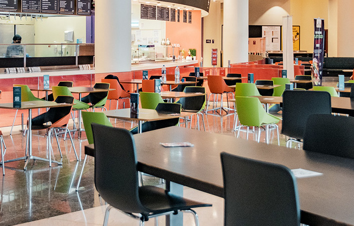

# 30MFF Website
## Dining Hall Revisited ##

### Description ###

 
This website houses the short film that my teammate and I created for the Interactive Media class - **Communications Lab** - Fall 2022 semester. We created and edited this film within 30 minutes as part of the 30MFF - *30 Minutes Film Festival* - exercise that we did in class. This website was created to convey the idea and story of the said film in a more organized way. 

The film is about the East Dining Hall, which we call D2, at our university NYU Abu Dhabi. D2 recently went through a lot of changes in terms of what kinds of food are offered in its different counters and what the counters themselves look like. So, the overall theme of the film is intended to be informative as it informs the audience of the current appearance of D2. The film was shot from the perspective of someone who was visiting D2 after two years and seeing the drastic changes to its different counters. So, I wanted my website to build on this theme by presenting more information on the changes that D2 counters went through over two years.

### Process ###

 
Since the content of the film is pretty straightforward and informative, I wanted the website to have a structured and approachable layout that reflects the straightforwardness of the content. That is why I separated the website into several pages based on the content and had a fixed header and navigation bar so that users can easily figure out where to look for what information. In order to make the concept and idea behind the film clear, there is a separate page about the D2 counters that mentions the changes. 

 
For the look of my website, I used the color yellow prominently on my website because it is the color that is most often associated with food/appetite and since my website is about the dining hall, I wanted that theme to be reflected. I chose my images to be representational; I used actual images of what D2 counters look like now and how they used to look before to reinforce the informative theme. I also added some animations and photo carousels to make the website a bit more dynamic and have elements of interactivity. The animations were added also to make the website look more semi-formal than strictly formal as the website is not any kind of official website for D2. 

 

 
In order to cater for more audience, I also put in some effort to make the website responsive to different screen sizes so that it becomes mobile-friendly.

### Reflection/Evaluation

 
The final working version of my website meets the expectations and goals I had set when I started working on this project. I was able to create a look and feel for the website as I had initially expected. Also, I think the website overall is able to capture the idea behind the film which was to document the changed appearance of D2. The website further complements the film by providing more details to the changes. With easy navigation, structured layout and semi-formal look and feel, I think that I have been able to meet my goals through this website.

* [Website](https://yashaswiim.github.io/30mff)
* [YouTube Video](https://youtu.be/4dh0zo2BQpc)
